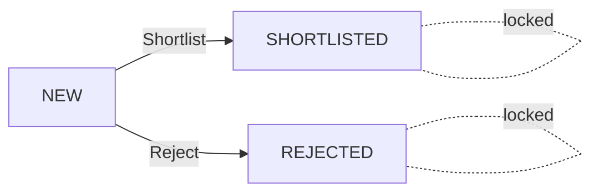

# Candidate Management System: Claude as product designr and hexagonal architecutre exploration
Demo URL: https://candidate-management-prototype.vercel.app/live-session

## Approach & Decision Record

### UI-First Development

The interface design was done before writing any business logic. By knowing exactly what the UI expects, APIs were designed to avoid overfetching and underfetching, and user experience was prioritized without being constrained by premature architectural or data decisions.

### Design Exploration

Claude Code was used to explore the design using HTML and CSS as a "figma board" — no JS, just static layouts to iterate fast on visual ideas.

**Design v1 — Kanban Board**

The first instinct was a Kanban board with three columns: New, Shortlisted, and Rejected. This is a familiar pattern in market candidate management tools.


However, a UX problem was identified: Shortlisted and Rejected are **terminal states**, once a candidate moves there, the column is immutable. Having two out of three columns locked is counterintuitive for a board layout.

**Design v2 — Decision-Centric Layout**

The mental model is better represented as a **decision flow**: New candidates can go to either Shortlisted or Rejected, and once decided, the decision is final.



So v2 shifts to a **search-and-decide UX**:

- **Home page**: Statistics, filters, search, and the full list of New candidates. A resizable sidebar panel for writing the decision reason and choosing Shortlist or Reject.
- **Shortlisted / Rejected tabs**: Read-only lists for conciliation and conferring purposes, with search, tag filters, and sorting.
- **Prefetched navigation**: Tabs pre-load on hover/focus for fluid transitions.


<!--  -->
<!--  -->

Additional UX decisions:
- The decision panel is **resizable** (drag or keyboard) so users can comfortably write longer reasons.
- LinkedIn URL was added to the candidate input to enrich data available for decision-making.
- The "Add Candidate" modal validates name (required), LinkedIn URL (optional, pattern-validated), and **tags** (optional, chip-style input).
- **Tag-based filtering**: All pages share a unified `FiltersBar` with search, tag chips, and sorting. Tags are free-form labels assigned at candidate creation, so users define their own taxonomy. The bar renders an "All" chip with the total count followed by toggleable tag chips derived from the current view's candidates — multi-select, intuitive, and consistent across New, Shortlisted, and Rejected pages.

### AI-Assisted Development Workflow

- **Design & Frontend**: Claude Code (Opus 4.6) with Chrome enabled for visual feedback loop. CSS Modules with raw CSS. Claude can one-shot translate to any CSS library later, so raw CSS gives maximum flexibility for prototyping.
- **Backend & Architecture**: Codex (GPT 5.3 extra high) as orchestrator with review-plan and review-code skills that trigger Claude Code (Opus 4.6) via CLI for review. This feedback loop achieves higher accuracy in a single pass. Codex also makes working with git worktrees really easy for parallel iteration.

### Architecture Decision: Hexagonal / Clean Architecture

The backend was built with **Hexagonal Architecture**, isolating the domain layer with all business rules and using dependency inversion for the repository interface.

A **separate controller layer was intentionally skipped** on the API routes. Since Next.js route handlers can call domain use cases directly and there are no additional business rules for the HTTP layer to handle, a controller would be pure indirection. HTTP status codes and error mapping are necessarily coupled to the Next.js framework, so they live in the route files. The collocation is intuitive: look at route files for HTTP handling, look at the domain for business rules.

---

## Architecture Overview

```
┌─────────────────────────────────────────────┐
│            Frontend (Pages + Components)     │
│  React components, CSS Modules, Providers   │
└──────────────────┬──────────────────────────┘
                   │ fetch()
┌──────────────────▼──────────────────────────┐
│            API Routes (Next.js)             │
│  Request validation (Zod) + Error mapping   │
└──────────────────┬──────────────────────────┘
                   │ use cases
┌──────────────────▼──────────────────────────┐
│            Domain Layer                      │
│  Entities · Rules · Use Cases · Schemas     │
│  Repository Interface (port)                │
└──────────────────┬──────────────────────────┘
                   │ implements
┌──────────────────▼──────────────────────────┐
│            Data Layer (Adapter)             │
│  InMemoryCandidateRepository               │
└─────────────────────────────────────────────┘
```

### Key Files

| Layer | Path | Purpose |
|-------|------|---------|
| **Domain** | `src/domain/candidate/entity.ts` | Candidate entity, factory functions, immutable DTO mapping |
| | `src/domain/candidate/rules.ts` | Business rules: transition validation, reason validation |
| | `src/domain/candidate/errors.ts` | Typed `DomainError` with codes: `VALIDATION`, `INVALID_TRANSITION`, `NOT_FOUND` |
| | `src/domain/candidate/schemas.ts` | Zod schemas for all DTOs and request payloads; TypeScript types inferred from schemas |
| | `src/domain/candidate/repository.ts` | Repository interface (port) — domain depends on this, not on implementations |
| | `src/domain/candidate/use-cases/` | `createCandidate`, `decideCandidate`, `listCandidates` — orchestrate rules + repository |
| **Data** | `src/data/storage.ts` | In-memory repository implementation with seed data |
| **API** | `src/app/api/candidates/route.ts` | `GET /api/candidates` and `POST /api/candidates` |
| | `src/app/api/candidates/[id]/decision/route.ts` | `POST /api/candidates/:id/decision` |
| | `src/app/api/http-error.ts` | Maps `DomainError` codes to HTTP status codes (400, 404, 409, 500) |
| **Frontend** | `src/app/live-session/page.tsx` | New candidates list + resizable decision panel |
| | `src/app/live-session/shortlisted/page.tsx` | Read-only shortlisted list with filters/sort |
| | `src/app/live-session/rejected/page.tsx` | Read-only rejected list with filters/sort |
| | `src/app/live-session/layout.tsx` | Wraps pages in `CandidatesProvider` + sidebar layout |
| | `src/providers/CandidatesProvider.tsx` | React Context for global candidate state and refresh |
| | `src/components/` | Reusable UI: `DecisionPanel`, `CandidateRow`, `FiltersBar`, `AddCandidateModal`, `Sidebar`, `Avatar`, `StatusChip`, `StatsRow`, `MainHeader` |

### Business Rules Enforced

| Rule | Enforced In | Error |
|------|------------|-------|
| Cannot shortlist a rejected candidate | `rules.ts` → `assertDecisionTransitionAllowed` | `INVALID_TRANSITION` (409) |
| Cannot reject a shortlisted candidate | `rules.ts` → `assertDecisionTransitionAllowed` | `INVALID_TRANSITION` (409) |
| Reason must be at least 10 characters | `rules.ts` → `validateDecisionReason` + `schemas.ts` | `VALIDATION` (400) |
| Name is required for new candidates | `schemas.ts` → `CreateCandidateRequestSchema` | `VALIDATION` (400) |
| LinkedIn must be a valid URL pattern | `schemas.ts` + `components/lib/linkedin.ts` | `VALIDATION` (400) |
| Tags max 10 per candidate, max 50 chars each | `schemas.ts` → `TagSchema` + `CreateCandidateRequestSchema` | `VALIDATION` (400) |

### Validation Strategy: Three Layers

1. **Zod Schemas** (`schemas.ts`): Type safety, constraints, and error messages. Used in API routes via `safeParse()` and types are inferred for full TypeScript safety.
2. **Domain Rules** (`rules.ts`): Pure functions for state transitions and business constraints. Framework-agnostic, independently testable.
3. **Frontend UX**: Real-time feedback (character count, button state) so users know what's expected before submitting.

---

## Frontend Decisions

- **SSR for initial data load**: Pages use server-side data fetching to avoid loading spinners and improve performance (server is closer to the data store).
- **Prefetch on intent**: All tab navigation links prefetch on hover/focus, pre-loading components and content before the user clicks — significantly smoother UX.
- **API calls collocated with components**: Rather than abstracting API calls into a separate service layer, they live inside the components that need the data. This avoids early abstraction, follows Next.js collocation patterns, and makes SSR understanding easier.
- **React Context for shared state**: `CandidatesProvider` holds the candidate list and a `refreshCandidates()` callback. Pages filter by status locally.
- **CSS Modules (raw CSS)**: No CSS library. Claude Code can one-shot convert raw CSS to any library later, so raw CSS maximizes flexibility during prototyping.
- **React Hook Form + Zod resolvers**: Forms (`DecisionPanel`, `AddCandidateModal`) use React Hook Form with `@hookform/resolvers/zod`, connecting the same Zod schemas used in the API routes. This gives global type-safety from form input to API validation — a single schema change propagates to both client and server validation automatically.
- **Resizable decision panel**: Uses pointer capture events for smooth drag resizing, with keyboard support (arrow keys) for accessibility.

---

## Lint & Type Checking

- **Linting**: [oxlint](https://oxc.rs/docs/guide/usage/linter) — a fast Rust-based linter. Chosen over ESLint for speed; it runs in milliseconds even on the full codebase, making it practical to run on every save and in CI without slowing down the feedback loop.
- **Type checking**: `tsc --noEmit` — standard TypeScript compiler check without emitting files. Catches type errors across the entire project including Zod-inferred types and React Hook Form generics.

```bash
bun run lint              # Run oxlint
bun run lint:fix          # Run oxlint with auto-fix
bun run typecheck         # Run tsc --noEmit
```

---

## Testing Strategy

### Unit Tests (Vitest)

Focus on the **domain layer** — the most critical and business-rule-heavy code, and that can be singularly reused in the future:

```
src/__tests__/domain/candidate/
├── entity.test.ts              # Factory functions, immutability, DTO mapping
├── errors.test.ts              # Typed error construction and type guards
├── rules.test.ts               # Transition validation, reason validation
└── use-cases/
    ├── create-candidate.test.ts   # Creation happy path and edge cases
    ├── decide-candidate.test.ts   # Decision transitions, validation, persistence
    └── list-candidates.test.ts    # DTO conversion and listing
```

Domain tests use a **mock repository** that implements the `CandidateRepository` interface, proving the hexagonal architecture works — domain logic is fully testable without any infrastructure dependency.

### E2E Tests (Playwright)

Cover the full user experience, end to end:

```
src/__tests__/e2e/tests/
├── 01-navigation.spec.ts          # Sidebar navigation and route changes
├── 02-new-candidates.spec.ts      # Candidate list rendering and selection
├── 03-shortlisted-page.spec.ts    # Filters, search, and sorting
├── 04-rejected-page.spec.ts       # Filters, search, and sorting
├── 05-api-routes.spec.ts          # Direct API endpoint testing
├── 06-decision-validation.spec.ts # Form validation and error states
├── 07-add-candidate.spec.ts       # Create candidate flow
└── 08-decision-flow.spec.ts       # Full decision making flow
```

E2E tests use **page objects** (`src/__tests__/e2e/pages/`) for reusable selectors and actions, and **API helpers** for seeding data and making assertions.

> Note: 1 worker is used for E2E tests to avoid race conditions (since storage is in-memory)
### Running Tests

```bash
bun run test              # Unit tests (Vitest)
bun run test:watch        # Unit tests in watch mode
bun run test:e2e          # E2E tests (Playwright)
bun run test:e2e:headed   # E2E tests with browser visible
bun run test:e2e:ui       # E2E tests with Playwright UI
```

---

## CI

A GitHub Actions workflow runs on every push, executing three checks in sequence:

1. **Typecheck** — `tsc --noEmit`
2. **Lint** — `oxlint`
3. **Test** — `vitest run`

E2E tests (Playwright) are not included in CI for this version. The in-memory storage lacks strong concurrency guarantees, so E2E tests run with a single worker to avoid race conditions — this makes them too slow for a CI feedback loop.

See [`.github/workflows/ci.yml`](.github/workflows/ci.yml) for the full configuration.

---

## Getting Started

```bash
bun install
bun run dev
```

Open [http://localhost:3000/live-session](http://localhost:3000/live-session)

---

## Tech Stack

- **Bun** — JavaScript runtime and package manager. Used for dependency management (`bun install`) and running scripts (`bun run`). Chosen for its speed — installs and script startup are noticeably faster than npm/yarn, which tightens both the local dev loop and CI feedback time.
- **Next.js 14** — App Router, API Routes, SSR
- **React 18** — Components, Context, Hooks
- **TypeScript** — Strong typing throughout
- **Zod 4** — Schema validation with type inference
- **Vitest** — Unit testing (faster than Jest)
- **Playwright** — E2E testing
- **CSS Modules** — Scoped styling, no runtime overhead
